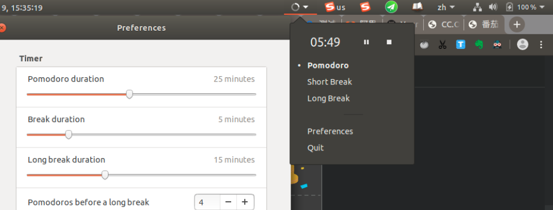

# pomodoro
---------------------------
https://gnomepomodoro.org/

## 1.intro
+ GNOME app
+ Manage time according to Pomodoro Technique
+ Has a GNOME shell extension
+ Focus on your work 25minutes
+ Hide other notification (nerver tried)

## 2.install
- see https://gnomepomodoro.org/
- this tell you how to install app, but not gnome shell extension 
- if you need a shell extension. do `sudo apt-get install gnome-shell-pomodoro`
- Enable the extension using gnome-tweak-tool(very simple and very important)

## 3.usage 
- just like 1+1=2

## 4.result 
