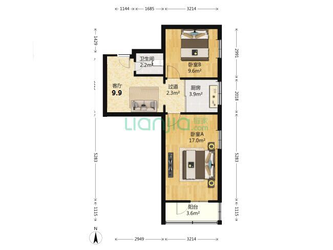
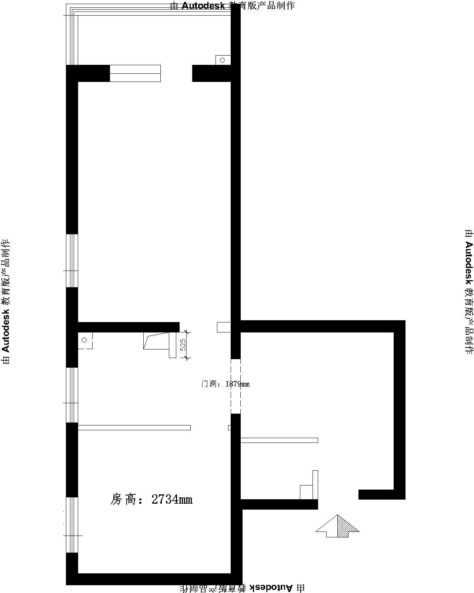
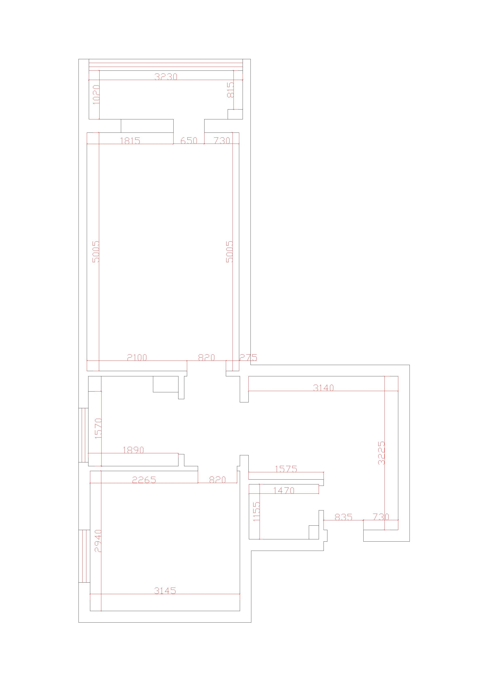
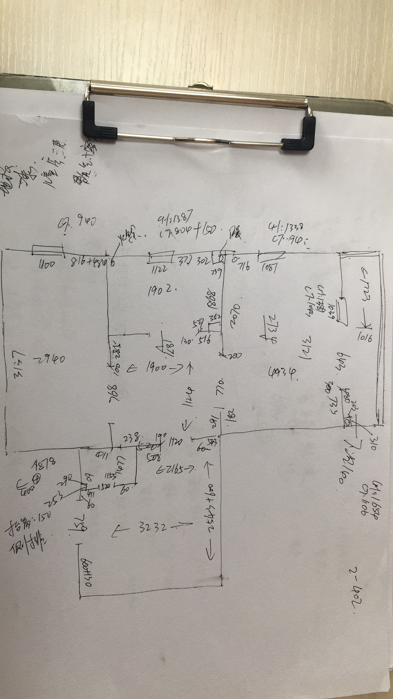
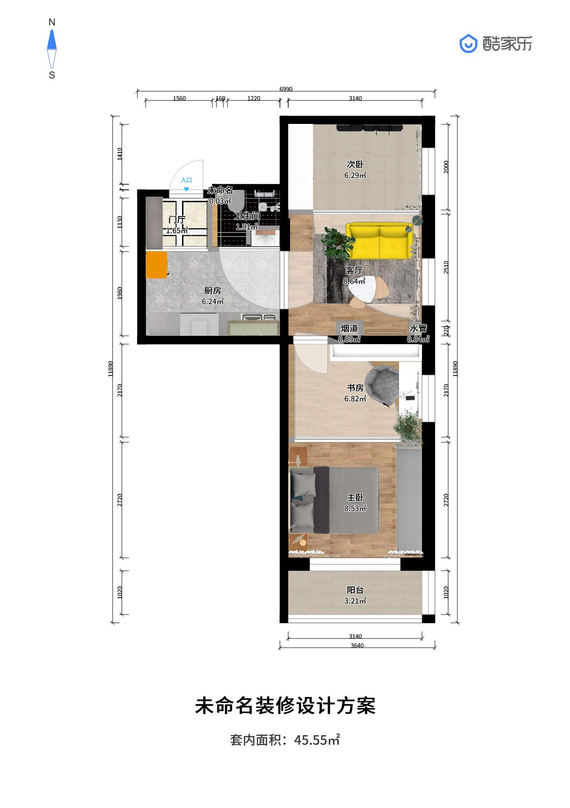
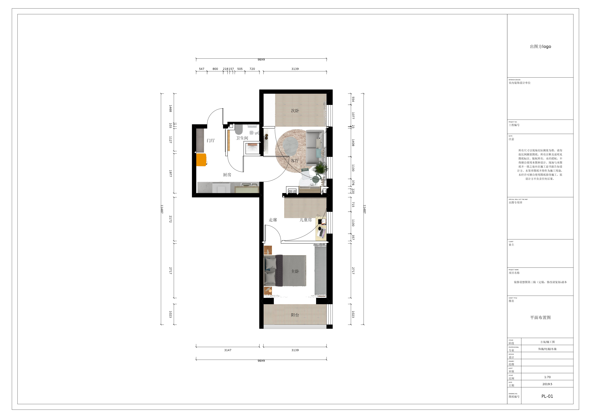
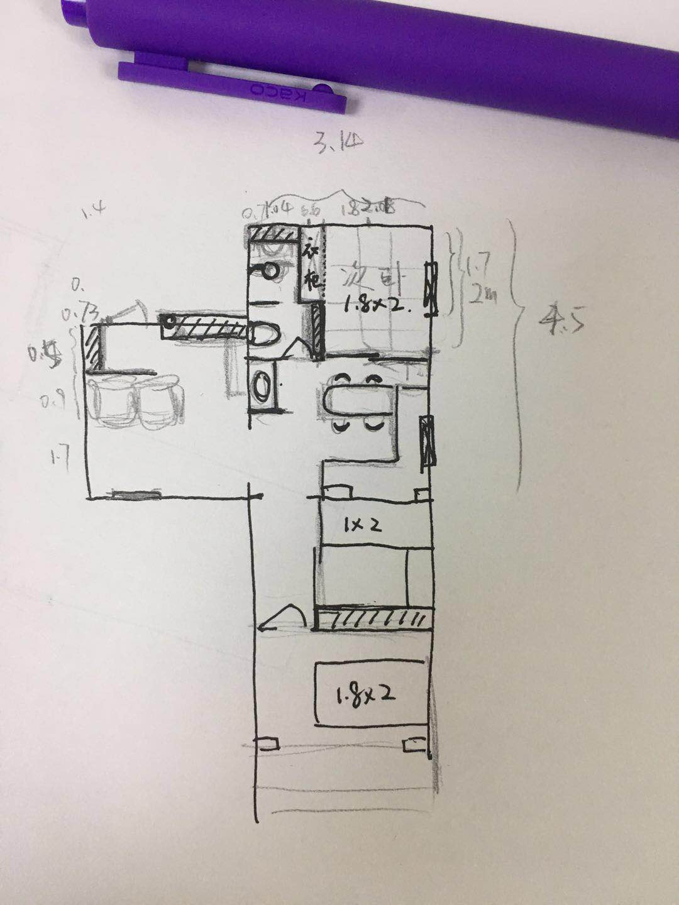

预算
-----------------------
+ 包含家电等
+ 二十万以内

卫生间
-----------------------
+ 实现至少两分离。洗手盆要在卫生间外面。
+ 储物空间要足够。

厨房
----------------------------
+ 需要移位，面板水槽高度85，煤气灶高度75.

客厅
------------------------------
+ 实现客厅功能，需要沙发电视等。
+ 可能需要在客厅兼容餐厅功能，餐厅功能可伸缩，就餐时可以看电视。

主卧
------------------------------
+ 原来的主卧需要一分为二，分别为主卧和书房兼儿童房（三年内为书房，三年后为儿童房，儿童发至少能满足儿童到七岁）。

侧卧
---------------------------------
+ 榻榻米通铺，与客厅连通，不设墙体。又能在需要的时候变成私密的空间。

阳台
---------------------------------
+ 下沉13公分。做一个榻榻米，需要放置一个梳妆台，梳妆台要能避免化妆品被晒坏。

门厅
---------------------------------
+ 需要穿鞋凳和鞋架，需要一个仪容整理镜。

其他
--------------------------------
+ 有健身爱好。中高阶健身爱好。

户型图
---------------------------------
##### 原始布局图

##### 户型图一(户型正确，无数据)

##### 户型图二(户型有误，有数据)

##### 实测原始数据

##### 预想设计图1

##### 预想设计图2

##### 预想设计图3

