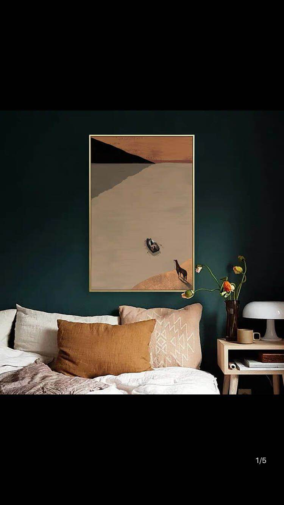
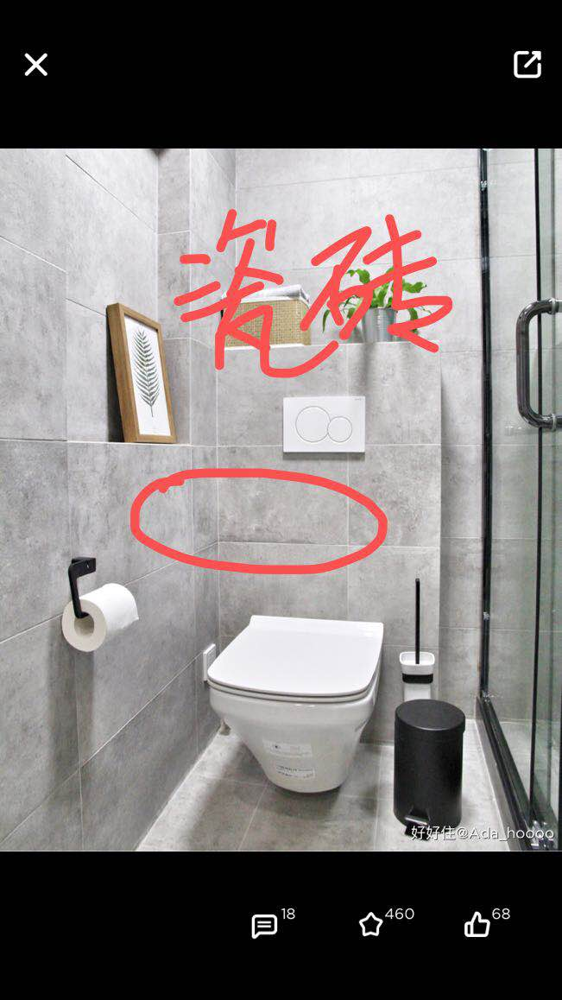

卧室
-----------------------------
##### 样例一

##### 样例二

##### 样例三

##### 样例四

##### 样例五

卫生间
-----------------------------
##### 样例一

##### 样例二

##### 样例三

##### 样例四

##### 样例五

厨房
-----------------------------
##### 样例一

##### 样例二

电视墙
-----------------------------
+ 电视墙的主要想法是要整齐的收纳空间，不是为了要白色
+ 颜色没有要求

##### 样例一

##### 样例二

##### 样例三

##### 样例四

衣柜
-----------------------------
##### 样例一

##### 样例二

整体风格喜好
---------------------------------

#### 风格一：撞色

##### 样例一

##### 样例二

##### 样例三

##### 样例四

##### 样例五

##### 样例六

#### 风格二：复古

##### 样例一

##### 样例二

##### 样例三

##### 样例四

##### 样例五

#### 风格三：INS风

##### 样例一

##### 样例二

##### 样例三

##### 样例四

长虹玻璃
------------------------------
+ 长虹玻璃的漫反射，既能营造出墙面的效果，又能不至于挡光。美观且厚度小
+ 难点：问过多家公司，不知道从哪里定做长虹玻璃
+ 淘宝有售：一个北京的店铺（【5mm超白长虹玻璃】https://m.tb.cn/h.edwEw0Q?sm=b10435 点击链接，再选择浏览器咑閞)

##### 样例一

##### 样例二

##### 样例三

超薄折叠门
----------------------------
+ 【日本立川豪华质感家用折叠门室内防水防污隔断门定制客厅卧室】https://m.tb.cn/h.edDnP0v?sm=e8bff2 点击链接，再选择浏览器咑閞；

##### 样例一

##### 折叠门店铺

玻璃墙转角
---------------------------

##### 样例一

